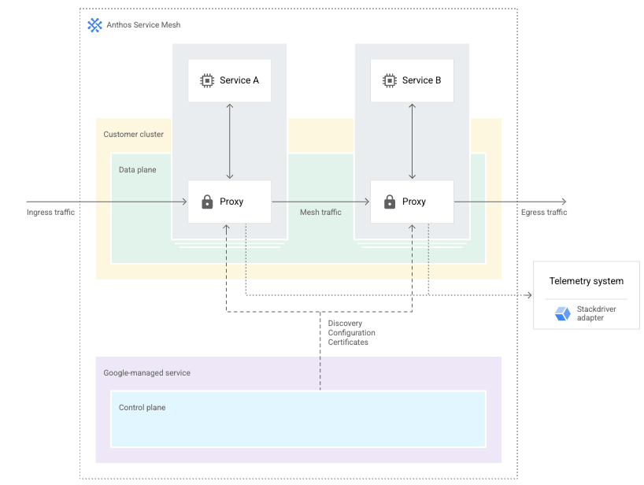

# Anthos Service Mesh Managed Control Plane

This guide is a cheat sheet to easily demonstrate the deployment of istio OSS on a GKE Cluster. Once done we'll migrate to Anthos Service Mesh - Managed Control Plane. Most of the steps are subject to change soon because ASM MCP is still in Public Preview. Always refer first to Google Cloud documentation to get up to date instructions :

- [Managed Control Plane guide](https://cloud.google.com/service-mesh/docs/managed-control-plane)
- [Istio instalation guide](https://istio.io/latest/docs/setup/install/istioctl/)
- [Anthos Service Mesh Installation Guide](https://cloud.google.com/service-mesh/docs/scripted-install/gke-install)

## Architecture



## Pre-requisites

Please refer to official documentation : [Managed Control Plane - Prerequisites](https://cloud.google.com/service-mesh/docs/managed-control-plane#prerequisites)

Your GKE cluster must meet the following requirements:

- A machine type that has at least 4 vCPUs, such as e2-standard-4. If the machine type for your cluster doesn't have at least 4 vCPUs, change the machine type as described in [Migrating workloads to different machine types](https://cloud.google.com/kubernetes-engine/docs/tutorials/migrating-node-pool).

- The minimum number of nodes depends on your machine type. Anthos Service Mesh requires at least 8 vCPUs. If the machine type has 4 vCPUs, your cluster must have at least 2 nodes. If the machine type has 8 vCPUs, the cluster only needs 1 node. If you need to add nodes, see [Resizing a cluster](https://cloud.google.com/kubernetes-engine/docs/how-to/resizing-a-cluster).

- By default, the script enables [Workload Identity](https://cloud.google.com/kubernetes-engine/docs/how-to/workload-identity) on your cluster. Workload Identity is the recommended method of calling Google APIs. Enabling Workload Identity changes the way calls from your workloads to Google APIs are secured, as described in [Workload Identity limitations](https://cloud.google.com/kubernetes-engine/docs/how-to/workload-identity#limitations).

- If you are doing a new installation and plan to use Anthos Service Mesh certificate authority (Mesh CA), you can use the [environ workload identity pool](https://cloud.google.com/anthos/multicluster-management/environs#environ-enabled-components) as an alternative to GKE workload identity. To use Mesh CA with environ (Preview), you need to either follow the steps in [Registering a cluster](https://cloud.google.com/anthos/multicluster-management/connect/registering-a-cluster) before running the script or include the --enable-registration flag when you run the script to let the script register the cluster to the project that the cluster is in. For an example of running the script to use the environ workload identity pool, see [Enable Mesh CA with environ](https://cloud.google.com/service-mesh/docs/scripted-install/gke-install#enable_mesh_ca_with_environ).

## Environment setup

```sh
export PROJECT_ID=$(gcloud config get-value project)
export PROJECT_NUMBER=$(gcloud projects describe ${PROJECT_ID} \
    --format="value(projectNumber)")
export CLUSTER_NAME=asm-mcp-demo
export CLUSTER_ZONE=us-central1-a
export LOCATION=us-central1
export WORKLOAD_POOL=${PROJECT_ID}.svc.id.goog
```

## Create a cluster

```sh
gcloud config set compute/zone ${CLUSTER_ZONE}
gcloud beta container clusters create ${CLUSTER_NAME} \
    --region=${LOCATION} \
    --machine-type=n1-standard-4 \
    --num-nodes=3 \
    --workload-pool=${WORKLOAD_POOL} \
    --enable-stackdriver-kubernetes \
    --subnetwork=default \
    --release-channel=regular
```

## Istio Installation

1. Go to the Istio release page to download the installation file for your OS, or download and extract the latest release automatically (Linux or macOS):

```sh
curl -L https://istio.io/downloadIstio | sh -
```

2. Move to the Istio package directory. For example, if the package is istio-1.9.2:

```sh
cd istio-1.9.2
```

The installation directory contains:

- Sample applications in samples/
- The istioctl client binary in the bin/ directory.

3. Add the istioctl client to your path (Linux or macOS):

```sh
export PATH=$PWD/bin:$PATH
```

4. Let's perform a simple installation of Istio :

```sh
istioctl install
```

5. Add a namespace label to instruct Istio to automatically inject Envoy sidecar proxies when you deploy your application later:

```sh
kubectl label namespace default istio-injection=enabled
```

We assume here that we will use the default namespace. Feel free to use another one according to your needs.

## Deploy bookinfo

1. Deploy the Bookinfo sample application:

```sh
kubectl apply -f samples/bookinfo/platform/kube/bookinfo.yaml
```

2. Associate the application with the Istio gateway

```sh
kubectl apply -f samples/bookinfo/networking/bookinfo-gateway.yaml
```

3. Ensure that there are no issues with the configuration:

```sh
istioctl analyze
```

4. Retrieve `istio-ingressgateway` IP address

```sh
kubectl get svc istio-ingressgateway -n istio-system
```
And test your application by accessing : `http://EXTERNAL_IP/productpage`

## Download installation script for Managed Control Plane

1. Download the version of the script that installs Anthos Service Mesh 1.9.2 to the current working directory:

```sh
curl https://storage.googleapis.com/csm-artifacts/asm/install_asm_1.9 > install_asm
```

2. Download the SHA-256 of the file to the current working directory:
```sh
curl https://storage.googleapis.com/csm-artifacts/asm/install_asm_1.9.sha256 > install_asm.sha256
```

3. With both files in the same directory, verify the download:

```sh
sha256sum -c --ignore-missing install_asm.sha256
```

If the verification is successful, the command outputs: `install_asm: OK` For compatibility, the preceding command includes the `--ignore-missing` flag to allow any version of the script to be renamed to `install_asm`.

4. Make the script executable:

```sh
chmod +x install_asm
```

## Apply Google Managed Control Plane

Run the installation script for each cluster that will use the Google-managed control plane:

```sh
./install_asm --mode install --managed -p ${PROJECT_ID} \
    -l ${LOCATION} -n ${CLUSTER_NAME} -v \
    --output_dir ${CLUSTER_NAME} --enable-all
```

The script will download to the specified `--output_dir` all the files for configuring the managed control plane, installing an Istio Gateway, along with the istioctl tool and sample applications.

## Install the Istio Ingress Gateway (optional)

Change directory to the root of the installation directory. Inspect the content of the `managed_control_plane_gateway.yaml` file, and edit the file if necessary.

From the root of the installation directory, use the istioctl tool to install the Istio Gateway by running this command:

```sh
./bin/istioctl install -f managed_control_plane_gateway.yaml --set revision=asm-managed -y
```

When the previous command finishes, check for a new gateway service by using the following command:

```sh
kubectl get services -n istio-system
```

In addition, one or more ingress gateways should appear in the output of the following command, depending on the configuration in the managed_control_plane_gateway.yaml file:

```sh
kubectl get pod -n istio-system
```
Verify the expected output:
```sh
NAME                                    READY   STATUS    RESTARTS   AGE
istio-ingressgateway-8fd856768-9hjdb    1/1     Running   0          44s
istio-ingressgateway-8fd856768-t5xtm    1/1     Running   0          44s
```

## Update istio-injection labels

The Anthos Service Mesh Google-managed control plane only supports migration from Anthos Service Mesh 1.9 that uses Mesh CA.

To migrate to Google-managed control plane, perform the following steps:

1. Replace the current namespace label with the `istio.io/rev:asm-managed` label:

```sh
kubectl label namespace default istio-injection- istio.io/rev=asm-managed \
   --overwrite
```

2. Perform a rolling upgrade of deployments in the namespace:

```sh
kubectl rollout restart deployment -n default
```

## Delete old control plane

After you install and confirm that all namespaces use the Google-managed control plane, you can delete the old control plane.

```sh
kubectl delete Service,Deployment,HorizontalPodAutoscaler,PodDisruptionBudget istiod -n istio-system --ignore-not-found=true
```

If you used `istioctl kube-inject` instead of automatic injection, or if you installed additional gateways, check the metrics for the control plane, and verify that the number of connected endpoints is zero.
